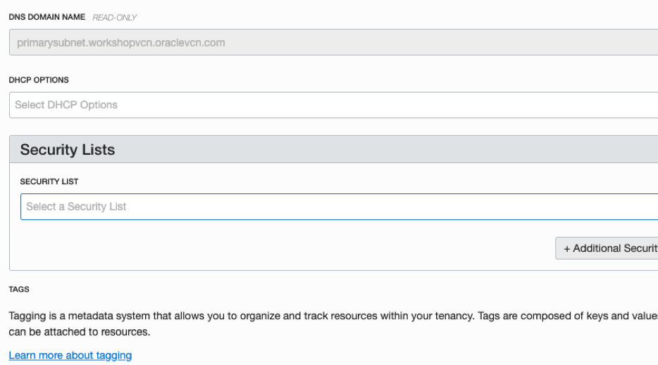

## Introduction

This lab will give you a basic understanding of the Oracle Cloud Infrastructure Database as a Service (DBaaS) offering and some of the capabilities around administration and database development.  Note that this workshop uses Oracle's Oracle Cloud Infrastructure (OCI) Database VM service, and not the legacy 'Classic' service or Bare Metal service.  

This lab will walk you through creating a new Database, and then have you connect into the Database instance using an ssh private key to familiarize yourself with command line administration. Next, you will connect to the database using SQLDeveloper and create a new sample table. You'll then back up the database to OCI Object Storage using RMAN, drop a table, and then restore from that backup.  **You must be off VPN to do this lab.**

**Note:  It will be very helpful to have a notepad open as a holding place to copy and paste various items throughout all the labs.** 


## Objectives

-	Familiarize yourself with the Oracle Cloud Infrastructure
-	Create a Virtual Cloud Network (VCN) and other necessary resources
-	Create Database as a Service instance
-   Configure and connect via SSH
-   Connect and create resources via SQLDeveloper
-   Backup and restore database

## Required Artifacts

-   If you are on Linux/OSX, the following lab requires [SQLDeveloper](https://www.oracle.com/technetwork/developer-tools/sql-developer/downloads/index.html)
-   If you are on Windows, you will need both [SQLDeveloper](https://www.oracle.com/technetwork/developer-tools/sql-developer/downloads/index.html) and the latest version of [PuTTY](https://www.putty.org) 


## Access our Environment

<details><summary>STEP 1:  Log into your Oracle Cloud Account</summary>
Navigate to https://cloud.oracle.com and click "Sign In"


Enter the name of the tenancy that you created when you signed up. This information will be included in the welcome email that you received when you signed up if you've forgotten. 


Log in with your credentials.


This page is called the "My Services Dashboard". This is where we can access any of the Oracle Cloud Services, including Oracle Cloud Infrastructure, Oracle Analytics Cloud, Oracle Integration Cloud, etc. Additionally, this page can be used to see billing information and manage your account. We want to create infrastructure resources, so expand the hamburger menu in the top left corner and click on "Database". 


</details>

## Setup and Resource Creation
<details><summary>STEP 2: Create Network Resources</summary>

We are now in the Oracle Cloud Infrastructure (OCI) console. This is the primary dashboard for creating any infrastructure resources, including Virtual Cloud Networks (VCNs), Compute Instances, Database as a Service Instances (DBaaS), Autonomous Databases (ATP/ADW), etc. 

We will be creating an architecture that looks quite similar to the image below (we will *not* be creating a NAT gateway, Dynamic Routing Gateway, or custom Security List). It looks a bit complicated, but it is actually fairly straightforward. 

We need a [network](https://docs.cloud.oracle.com/iaas/Content/Network/Tasks/managingVCNs.htm) to hold all of our resources, and in that network we'll need a subnet to hold our [DBaaS instance](https://docs.cloud.oracle.com/iaas/Content/Database/Concepts/overview.htm). We'll store our backups in [Oracle Cloud Object Storage (OS)](https://docs.cloud.oracle.com/iaas/Content/Object/Concepts/objectstorageoverview.htm), which is a robust and cost-efficient platform for storing unlimited amounts of unstructured data. To communicate with Object Storage, we'll set up a [Service Gateway](https://docs.cloud.oracle.com/iaas/Content/Network/Tasks/servicegateway.htm) on our network to allow traffic between OS and our network.

 

In order to create our Database as a Service instance, [we'll first need to set up a Virtual Cloud Network (VCN) to hold our database.](https://docs.cloud.oracle.com/iaas/Content/Database/Tasks/network.htm) Click on the hamburger menu at the top left again and navigate to "Network". 

*Note that as we are now in the OCI console rather than at the "My Services" level, the menu options have changed quite a bit. In order to navigate back to the My Services dashboard, scroll down in the OCI hamburger menu options and select "My Services Dashboard"*


Click on "Create Virtual Cloud Network" and enter details matching the image below. 


**Subnet**

Once created, click on the new network to view the network details. We'll need a subnet to hold our database, so click "Create Subnet" and enter details matching the images below:




Note that we left a few of the options empty. This is fine - these will be assigned to the default choices that were created when we made our VCN.

**Internet Gateway**

Back on the VCN details page for our network, navigate to the "Internet Gateways" option. Click "Create Internet Gateway", and enter details matching the image below:


**Security List**

Naturally, we want to be able to communicate with the database that we're about to create. Network access in OCI is primarily managed by rules in [Security Lists](https://docs.cloud.oracle.com/iaas/Content/Network/Concepts/securitylists.htm). By default there are only a few security rules active (allow Port 22 - SSH traffic and allow ICMP 3 and 4). If we were to attempt to connect to our database with SQLDeveloper before creating a security list rule to allow the traffic (which uses the standard database port - 1521), the connection would fail. 

Here we'll create a security list rule to allow for traffic over port 1521 into our network. Back on the VCN details page for our network, navigate to the "Security Lists" option. Click on the "Default Security List for workshopvcn", and enter details matching the image below:

(*Note: it will not affect us here in this lab, but your instances running Oracle-provided Linux images or Windows images also have firewall rules that control access to the instance. When troubleshooting access to an instance, make sure both the security lists associated with the instance's subnet and the instance's firewall rules are set correctly. This is a very common issue when running network-connected applications on cloud servers.*)


**Service Gateway**

The Oracle Services Network is a conceptual network in Oracle Cloud Infrastructure that is reserved for Oracle services. These services have public IP addresses that can be reached over the internet. However, you can access the Oracle Services Network public IP addresses without the traffic going over the internet. Even though we will be encrypting our backups, this is good for security-minded folks like ourselves who would much rather keep our traffic on secure networks.

Back on the VCN details page for our network, navigate to the "Service Gateways" option. Click on "Create Service Gateway", and enter details matching the image below:


**Route Table**

The last network resource that we'll need to work on is a [Route Table](https://docs.cloud.oracle.com/iaas/Content/Network/Tasks/managingroutetables.htm). VCNs uses virtual route tables to send traffic out of the VCN (for example, to the internet, to your on-premises network, or to a peered VCN). These virtual route tables have rules that look and act like traditional network route rules you might already be familiar with. Each rule specifies a destination CIDR block and the target (the next hop) for any traffic that matches that CIDR. Along with CIDR targets, we can also specifiy a service gateway as our target, which we will be doing here.


</details>

<details><summary>STEP 3:  Create our SSH Keys</summary>

**NOTE: IF USING PREMADE WORKSHOP RESOURCES DOWNLOAD SSH KEYS [HERE](./SSH_Keys.zip)**
**If you are using a Windows machine you will need to download an SSH client like PuTTY as described in the "Windows" section below**


Generate SSH keys to be used later while launching an instance.

#### MAC/LINUX 

1. Generate ssh-keys for your machine if you don’t have one. As long as an id_rsa and id_rsa.pub key pair is present they can be reused. By default these are stored in ~/.ssh folder. Enter the following command if you are using MAC or Linux Desktop:
   
```   
   # ssh-keygen
```

2. Make sure permissions are restricted, sometimes ssh will fail if private keys have permissive permissions.
   
``` 
    # chmod 0700 ~/.ssh  
    # chmod 0600 ~/.ssh/id_rsa  
    # chmod 0644 ~/.ssh/id_rsa.pub
```

#### Windows
1. Download PuTTY (https://www.putty.org)
2. Run PuTTY
3. Select RSA – 2048 and click Generate. Move mouse to generate randomness. You can keep the passphrase blank.
4. Save the private key file as “workshop-ssh.ppk”. 
5. Select all of the text in the public key text box at the top, copy it, paste it to a text file, and save the new file as “workshop-ssh.pub”


</details>

<details><summary>STEP 4:  Launch our Database</summary>

We are now ready to [provision our DBaaS Instance](https://docs.cloud.oracle.com/iaas/Content/Database/Tasks/launchingDB.htm). Click the hamburger menu in the top left again, and select the "Bare Metal, VM and Exadata" option under Database. Once there, press "Launch DB System".


At the Launch DB System page, enter information matching the screenshots below:


It will generally take anywhere from between 30mins to an hour for our database to complete provisioning. In the meantime, we will perform a few more tasks to get our tenancy ready to receive database backups.

</details>

<details><summary>STEP 5: Create our Object Storage Bucket</summary>
Oracle Cloud Infrastructure (OCI) Object Storage (OS) service is the recommended location for Oracle Database backups in the Cloud. Object Storage is an internet-scale, high-performance storage platform that offers reliable and cost-efficient data durability. The Object Storage service can store an unlimited amount of unstructured data of any content type, including analytic data and rich content, like images and videos.

With Object Storage, you can safely and securely store or retrieve data directly from the internet or from within the cloud platform. Object Storage offers multiple management interfaces that let you easily manage storage at scale.

Object Storage is a regional service and is not tied to any specific compute instance. You can access data from anywhere inside or outside the context of the Oracle Cloud Infrastructure.

For this lab, we will be creating a bucket where we will be storing our database's backups. Navigate to the Object storage page from the hamburger menu in the top left, and click "Create Bucket".


Enter details to match the image below. 


When the bucket has been successfully created, it will show up in the list of buckets on the Object Storage page.


*A quick note about security: There are two access levels for Object Storage buckets - [private or public](https://docs.cloud.oracle.com/iaas/Content/Object/Tasks/managingbuckets.htm). Public buckets are publicly available to anyone with the URL (so anyone on the internet). Private buckets can only be seen/managed by OCI users that have been assigned [IAM Policies](https://docs.cloud.oracle.com/iaas/Content/Identity/Concepts/overview.htm) that grant them access to Object Storage buckets. In this case we are administrators, so we already have the necessary access levels.*

*We will be keeping our bucket as private, and using an [auth token](https://docs.cloud.oracle.com/iaas/Content/Identity/Tasks/managingcredentials.htm) to validate access to our bucket when backing up from RMAN.*

</details>

<details><summary>STEP 6: Create our Auth Token</summary>
Auth tokens are Oracle-generated token strings that you can use to authenticate with third-party APIs that do not support Oracle Cloud Infrastructure's signature-based authentication. Each user created in the IAM service automatically has the ability to create, update, and delete their own auth tokens in the Console or the API. An administrator does not need to create a policy to give a user those abilities. Administrators (or anyone with permission to the tenancy) also have the ability to manage auth tokens for other users.

We'll be using our auth token to establish our identity when communicate with OCI via RMAN.

To create our auth token, click on the account logo at the top right of the OCI console, then click on your user account. This will bring you to your own user page.


On your user account page, navigate to "Auth Tokens" in the list of resources on the bottom left, and click "Generate Token". **NOTE: COPY THIS CODE TO A NOTEPAD! IT WILL ONLY BE DISPLAYED ONCE.**


</details>

## Database Tasks - Connecting, Backup, and Recovery
<details><summary>STEP 7: Connect to the Database with SQLDeveloper and Create a Sample Table</summary>

For this step, we'll be connecting to the database both via SQLDeveloper and SSH. Again, if you don't have SQLDeveloper installed, go ahead and grab that [here](https://www.oracle.com/technetwork/developer-tools/sql-developer/downloads/index.html), and if you do not have SSH Keys and PuTTY return to STEP 3. 


In order to connect to our database, we'll need the database node's IP and the service name for the listener. Return to the database details page for our database (hamburger menu -> Bare Metal, VM & Exadata -> click on our database). Click on "Nodes" under resources in the bottom left, and copy the public IP of our database node to the note file you've been using. 


Next, click on "Databases" under resources, and click show on the "Connection String" item. Copy everything after the final forward slash to your your note file. In this case, we'd want "db1_iad1hx.publicsub.corevcn.oracelvcn.com". 


Open up SQLDeveloper, and add a new connection. Enter information to align with the details in the screenshot below, but using the info that you just copied to your note file from the database details page. Note that you need to change the selection from "SID" to "Service name".  

Click "Test" to see if the connection has been set up correctly. You should receive a response saying "Success!". If successful, go ahead an click "Save" and then "Connect".

Once connected, we'll want to create a sample table. Copy and paste the script below into the SQLDeveloper worksheet view, and run the query. You should see output as below. 

**BE SURE TO CLICK COMMIT ONCE YOUR TABLE HAS BEEN CREATED AND LOADED IWTH SAMPLE DATA!**

```
CREATE TABLE customers (customer_id number(10) NOT NULL, customer_name varchar2(50) NOT NULL, city varchar2(50)); 

INSERT ALL 
INTO customers (customer_id, customer_name, city) VALUES  (1, 'Customer1', 'Chicago')
INTO customers (customer_id, customer_name, city) VALUES  (2, 'Customer2', 'Detroit')
INTO customers (customer_id, customer_name, city) VALUES  (3, 'Customer3', 'Los Angeles')
INTO customers (customer_id, customer_name, city) VALUES  (4, 'Customer4', 'New York')
INTO customers (customer_id, customer_name, city) VALUES  (5, 'Customer5', 'Rome')
SELECT * from dual;

select * from customers;
```


**Commit!**
</details>

<details><summary>STEP 8: SSH into our VM and configure RMAN</summary>

To configure RMAN, we'll need to SSH into the virtual machine hosting our DBaaS instance. If you're on Mac/Linux, open up Terminal, and if you're on Windows open up PuTTY (or another SSH client of your choice).

We'll be using the same Public IP address that we used in STEP 7 to establish our SSH connection.

Note that this stage of the workshop is a walkthrough of the instructions [here](https://docs.cloud.oracle.com/iaas/Content/Database/Tasks/backingupOSrman.htm). Check that page for more details.


Once we're connected, we're going to then run a few commands:

1. Switch to the oracle user:

```
sudo su – oracle
```

2. Create a directory to serve as our SBT library:
```
mkdir ~/lib/
```

3. Change to the directory that contains the backup module opc_install.jar file:
```
cd /opt/oracle/oak/pkgrepos/oss/odbcs
```

4. Use the following command syntax to install the backup module:
```
java -jar opc_install.jar -opcId <user_id> -opcPass '<auth_token>' -container <bucket_name> -walletDir ~/hsbtwallet/ -libDir ~/lib/ -configfile ~/config -host https://swiftobjectstorage.<region_name>.oraclecloud.com/v1/<tenant>
```
- <user_id> is your login ID (i.e. abcdefg@xyz.com)
- <auth_token> is the auth token that we just generated (saved on your notepad!)
- <bucket_name> is the name of the bucket that we just created
- <region_name> will be us-ashburn-1 (or us-phoenix-1, depending on the region we're using here)
- <tenant> will be the name of the tenancy we're using


Once the backup module has been installed successfully, it's time to configure RMAN. 

1. Make sure we're using the correct environment variables. oraenv should prompt with for the current db name (db1). If this is accurate, just press enter. Otherwise enter the name of our DB. (See the image below for reference) 
```
. oraenv
```

2. Start up RMAN:
```
rman target /
```

3. Configure RMAN to use the SBT device and point to the config file that was created when you installed the backup module.
```
CONFIGURE CHANNEL DEVICE TYPE 'SBT_TAPE' PARMS 'SBT_LIBRARY=/home/oracle/lib/libopc.so, SBT_PARMS=(OPC_PFILE=/home/oracle/config)';
```


4. Add each of the following configurations options:
```
CONFIGURE DEFAULT DEVICE TYPE TO SBT_TAPE; 
```
```
CONFIGURE BACKUP OPTIMIZATION ON; 
```
```
CONFIGURE CONTROLFILE AUTOBACKUP ON;
```
```
CONFIGURE CONTROLFILE AUTOBACKUP FORMAT FOR DEVICE TYPE SBT_TAPE TO '%F'; 
```
```
CONFIGURE ENCRYPTION FOR DATABASE ON;
```


Finally, it's time to back up our database!

1. Set an encryption password. Note that this parameter is session-specific. If you exit and reopen RMAN, you'll need to set this again.

```
SET ENCRYPTION IDENTIFIED BY "testpassword" ONLY;
```

2. Backup the database!
```
BACKUP INCREMENTAL LEVEL 0 SECTION SIZE 512M DATABASE PLUS ARCHIVELOG
```


</details>

<details><summary>STEP 9: Drop our Table and Restore from Backup</summary>

Once our database has been successfully backed up to Object Storage, we'll want to recover our database to make sure it actually worked!

Return to SQLDeveloper (you will probably have to refresh your connection - click the two blue arrows next to the new connection icon), and query the database for the current SCN using:
```
SELECT current_scn FROM v$database;
```
***Save this SCN in your notepad!! We will need it in a second.***


***Save this SCN in your notepad!! We will need it in a second.***

Once we have our current SCN, we can go ahead and drop the table we created:

```
DROP TABLE customers;

SELECT * FROM customers;
```


After we drop the table, ***commit***!

Finally, return to our command line tool and RMAN.

In RMAN enter:
```
SET DECRYPTION IDENTIFIED BY "testpassword";
```
And then:
```
RUN
{
	SHUTDOWN IMMEDIATE;
	STARTUP MOUNT;
	SET UNTIL SCN <ENTER_YOUR_SCN_HERE>;
	RESTORE DATABASE;
	RECOVER DATABASE;
	ALTER DATABASE OPEN RESETLOGS;
}
```

When the restore + recover is complete, return to SQLDeveloper and query for the table!


<br/>


Success!
</details>

## Conclusion
<details><summary>STEP 10: Conclusion and Further Learning</summary>


[The Oracle Cloud Infrastructure documentation](https://docs.cloud.oracle.com/iaas/Content/Database/Concepts/databaseoverview.htm) is a fantastic source for information about anything OCI. Much of this workshop was pulled from 
</details>